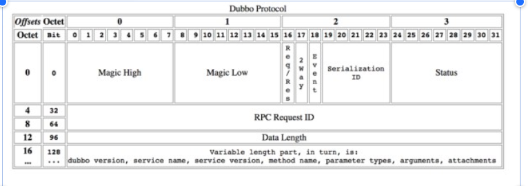

## 需求分析
### 场景分析

- 开发者希望在某个方法上启用压缩算法。例如在获取文章摘要的时候并不需要启用压缩算法，但是在获取文章详细内容的时候启用压缩算法
- 开发者希望在某个服务上启用压缩算法
- 开发者希望请求或者响应能够单独控制是否使用压缩算法，以及使用不同的压缩算法
  - 请求过去不使用压缩算法，但是响应过来使用了压缩算法；反过来也可以
  -  请求过去使用了 A 算法，但是响应过来使用了 B 算法

- 开发者希望能够自动检测传输数据大小，在传输数据超过一个阈值的时候启用压缩算法
-  开发者希望能够实时检测网络负载，在网络负载很高的时候启用压缩算法。跟进一步地，开发者希望在负载低的时候启用低压缩率的算法，在负载高的时候启用高压缩率的算法
- 开发者希望能够实时检测 CPU 使用率，在 CPU 使用率很高的时候弃用压缩算法

### 功能需求

- 支持不同的压缩算法
- 允许用户接入自定义算法
- 用户可以在服务层面上控制压缩算法，但是不需要在方法级别上控制压缩与否，以及使用何种算法
- 响应将采用和请求一样的压缩算法。即如果请求采用了压缩，那么响应会启用压缩算法，并且使用同样的压缩算法

### 非功能性需求
- 良好的扩展性，即用户可以使用不同的压缩算法
- 在将来我们可能会在方法级别，以及请求和响应分别控制压缩与否与压缩算法，所以在设计和实现的时候要注意别太死板

## 行业方案

### Dubbogo

Dubbogo 支持不同的 RPC 协议，并且在不同的 RPC 协议里面也支持不同的压缩算法。用户在使用 Dubbo 的时候需要先确认自己使用的 RPC 协议是否支持压缩算法，进一步还需要确认支持何种压缩算法。

在 Dubbogo 的 Dubbo 协议里面，并没有预留压缩的头部字段，所以使用 Dubbo 协议并不使用压缩算法：




事实上，我们也可以通过扩展 serialization 来支持压缩算法。即我们可以认为压缩算法是一种不同的序列化协议，但是这种做法的局限性很大，serialization 只有五个比特位，取值非常有限。复用 serialization 本质上是序列化算法和压缩算法的一个笛卡尔积。

在新协议 Triple 里面，它直接使用了 HTTP 作为传输协议，所以实际上可以直接使用 HTTP 的压缩设置。

### grpc

gRPC 提供了使用压缩算法的例子：https://github.com/grpc/grpc-go/tree/master/examples/features/compression。gRPC 设计了两个头部来支持压缩算法：

- Compressed-Flag：标记究竟有没有使用压缩算法
- Message-Encoding：压缩算法，用户可以在发起调用的时候指定压缩算法，从这里也可以看出来 gRPC 支持在单次调用维度上指定压缩算法

但是实际上启用两个头部看起来有点累赘。从理论上来说只需要有一个头部，并且如果请求或者响应没有这个头部，就认为没有启用压缩。又或者肯定有这个头部，但是当头部的值是某个值的时候，就认为没有压缩。


### HTTP协议
我们最熟悉的https://developer.mozilla.org/zh-CN/docs/Web/HTTP/Compression了，HTTP 协议设计了几个头部，相关的有：

- Content-Encoding：指示使用了什么压缩算法
- Accept-Encoding：服务器告知客户端自己能够处理什么压缩算法

Accetpt-Encoding 是一个很优雅的设计，它接近一种协商机制。即服务端告知了自己能够支持的压缩算法之后，客户端从中选择一个。而在绝大多数的通信协议里面并没有类似的机制，而是倾向于线下约定。

## 压缩算法
压缩算法和序列化协议一样，都是五花八门。总体上来说，选择一个压缩算法就是一个压缩比率和 CPU 开销之间做一个权衡。理论上来说不同的算法还有有损无损的区别，只是在我们的场景下只能选择无损的算法。
Go 本身的提供了几个算法：bzip2、flate、gzip、lzw、zlib。目前没有人对这几个算法做过系统分析和比较。

Linux 平台上提供了花样繁多的算法，这些算法就有比较多的比较和分析文章：

目前来说，使用最广泛的算法应该是 gzip，尤其是在 HTTP 通信中。从上面的表格也可以看到，gzip 总体来说是一个很中庸的算法，性能不算出色，压缩比率也不算出色。不过中庸也意味着适应性广泛，即在资源消耗和压缩比之间取得了一个良好的平衡。

除了 Go 本身自带的压缩算法，还有一个 github 开源仓库提供了更加多的压缩算法：
https://github.com/klauspost/compress


## 设计

### Api设计
三个方法（解压缩，和返回使用的压缩协议）
```azure
type Compresser interface {
	Compress(in []byte) ([]byte, error)
	Decompress(in []byte) ([]byte, error)
	Code() byte
}
    本次就用较为普通的压缩算法作为默认实现。
```


### 实现逻辑

实现压缩，我们放在最后一步，在序列化之后。用户将序列化好的数据，传入压缩的实现。最后发送请求或者响应。
解析请求或响应就相反。